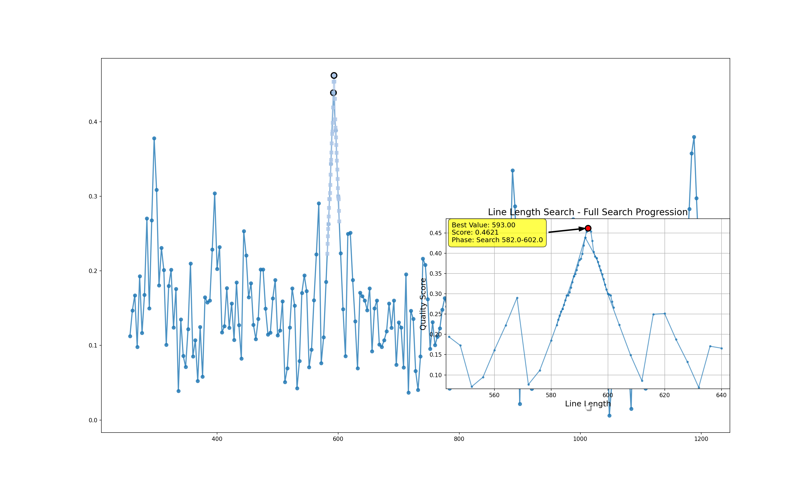
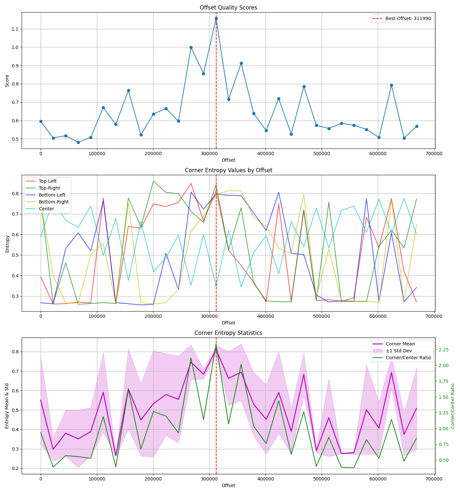
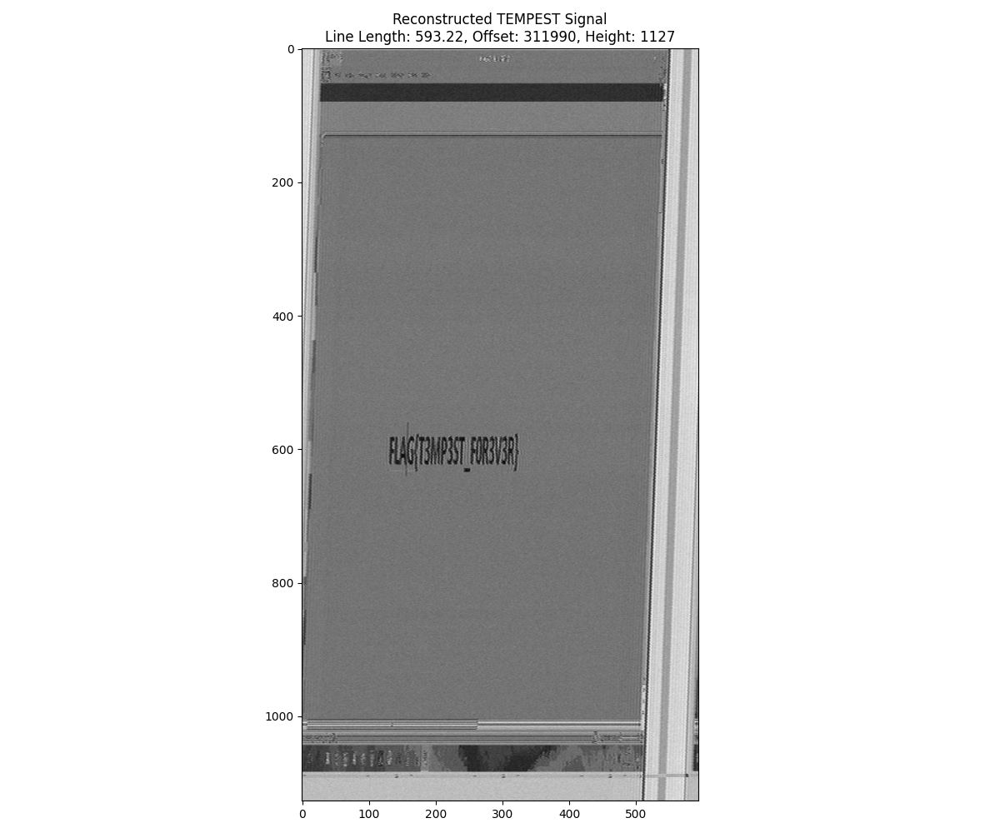

# Le calme avant la tempest

## Avertissement

Je me doutais que ce challenge pouvait être résolu avec TempestSDR mais je ne trouvais pas ça assez intéressant d'essayer de comprendre le projet et me suis mis en tête de faire cette extraction par moi-même.

Le code que je présente est probablement pas super optimal, je l'ai écrit pendant le CTF et la seule modification que je me suis permis d'y apporter est de séparer en plusieurs fichiers pour plus de lisibilité et vous éviter la lecture d'un fichier de 1694 lignes bien que ce soit recommandé par certains.

Enfin ma solution n'est pas de la grande cuisine et nécessite un léger affinage puisque je n'arrive pas encore à aligner parfaitement les images et un léger drift est encore présent puisque ma longueur de ligne n'est pas parfaite.

## Introduction

Ce challenge nous pourvoit un fichier qui est le dump d'une mesure des signaux parasites émis lors de la capture d'une vidéo. La capture est échantillonée sur 20 MHz et les données sont des entiers signés sur 16 bits.

Le nom du challenge est assez explicite nous sommes en train de refaire ce que la NSA a sobrement appelé [TEMPEST](<https://en.wikipedia.org/wiki/Tempest_(codename)>).

Puisque l'on nous dit que les émissions ont déjà été remises en forme par un logiciel de raster, on va commencer à expérimenter en supposant que le mécanisme de génération de l'image consiste en un balayage de l'écran pour écrire les lignes les unes après les autres, ce qui me semble le plus intuitif pour une télévision à tubes cathodiques. (Honnêtement je m'attendais à ce qu'il y ait un vrai balayage en aller retours pour des raisons de continuité de tension dans les bobines dans le téléviseur, mais en supposant que les lignes sont affichées une par une de la gauche vers la droite les résultats étaient très bons donc j'en suis resté là)

Le premier challenge est donc la détermination de la longueur d'une ligne. Après avoir fait quelques expériences itératives à la main, j'ai pu déterminer une longeur approchée intéressante 593 pixels.

De là on peut générer une image en prenant une hauteur de 2000 pixels et le flag appararaît. C'est sale mais ça marche. Attention cependant à ne pas faire comme moi et confondre un 0 avec un O. Si j'avais validé je me serai arrêté, mais puisque l'admin a qui j'ai posé la question (image à l'appui), m'a dit que j'étais pas loin j'ai décidé de tout automatiser et tenter de regénérer la vidéo complète.

## Détection de la longeur de ligne

Après plusieurs itérations pour trouver des critères pour qu'une image soit belle j'ai déterminé qu'il fallait plusieurs choses :

- Que toutes les lignes présentes sur l'image soit verticales : PAS DE DIAGONALES
- Que ce nombre de lignes soit minimal
- Que l'image soit la plus homogène possible
- Qu'il n'y ait pas de lignes de couleurs très différentes les unes des autres

Ce qui s'est traduit en la création d'une mesure de la "beauté" de mes images, celle-ci se base sur

- L'autocorrélation de mes images. Si on a une forte autocorrélation à la fréquence de base correspondant à ma longeur de ligne c'est que l'on a des motifs qui se répètent périodiquement sur mon image ligne par ligne
- Une mesure de l'homogénéité des images reconstituées. Celle-ci se passe en deux étapes :
  - Je compte le nombre de blocs de 30x30 avec une variance faible, donc le nombre de blocs pour lesquels la couleur est homogène. Ceci récompense les images quasi vides (puisque je sais que l'image a pas grand chose sinon le flag)
  - Une mesure de la différences entre deux lignes consécutives. Ceci à pour but de pénaliser les stries qui indiquent que je suis sur un multiple de la longueur optimale.
- Un score de verticalité de mon image. Celui-ci se base sur
  - Une mesure de l'homogénéité sur une colonne. On veut que les gradients le long d'une colonne soit les plus lisses possibles
  - Une mesure de la différence d'une colonne avec ses voisines. Si les colonnes sont bien alignées on veut maximiser la différence entre une colonne et ses voisines
  - Une pénalité diagonale. Si un léger shift augmente la ressemblance entre deux colonnes alors elles sont probablement en diagonale.

J'ai ensuite procédé iterativement en mesurant le score selon les deux premières métriques sur des longeurs de ligne entre 256 et 1200 (oui je ne pensais pas que l'image soit en 4k et les valeurs autour de 1100 était intéressantes donc je les ai gardées, et il y a un léger biais puisque je m'attends à trouver dans les 600 pixels et des bananes).
Une fois que je trouve la longeur avec le meilleur score et je me centre sur elle pour procéder cette fois-ci à une mesure plus fine du score de mon image avec tous les critères ci-dessus. J'ai procédé par une recherche binaire pour diviser par 10 la taille de mon intervalle jusqu'à trouver une valeur qui me satisfaisait.

A ce stade je suis assez satisfait de ma longueur même si l'image reste un tout petit peu trop longue, j'aurais pu passer plus de temps à évaluer quel pondération donner à chacun de mes scores mais bon il fallait aussi se mettre à faire d'autres challenges et j'étais encore loin d'avoir fini.

## Détection de la hauteur d'une image

Pour détecter la hauteur d'une image, je me suis dit que ce qui était le plus intéressant était :

- La périodicité des images, elles doivent se ressembler, si je trouve un motif qui se répète dans une image de 10000 pixels de long alors je sais probablement quelle est la longueur de l'image
- L'auto-corrélation de mes colonnes. Encore une fois si le motif qui se répète à pour fréquence celle de ma hauteur c'est bien.
- Le déplacement entre mes images consécutives. Les images sont censé peu changer entre elles, donc je calcule la différence au carré entre deux image pour obtenir un score de déplacement.
- La différence à la moyenne entre les lignes et les colonnes consécutives au sein d'une image. Cette mesure permet d'essayer de faire en sorte que l'image est dans son entièreté dans le cadre pour que au global cette différence soit aussi proche de la moyenne que possible.

Cette fois-ci j'ai aussi procédé à une recherche grossière suivie d'un affinage de la recherche en réduisant mon intervalle d'étude progressivement

## Détection de l'offset initial

La dernière chose restante est de centrer les images dans le cadre, puisqu'on ne sait pas quand la mesure a commencée.

Initialement je pensais que l'entropie maximale devait se situer au centre là où le texte s'afficherait, mais je n'avais pas réalisé que tout le bazard sur les côtés avait une entropie bien plus forte. Donc je me suis orienté vers une maximisation de l'entropie dans les coins, tout en conservant une bonne entropie au centre.

## Conclusion

On obtient une vidéo de qualité assez intéressante.
Rétrospectivement je pense qu'il y avait probablement des signaux de synchronisation dans la zone sur les bords de l'image qui auraient permis de déterminer la longueur de ligne plus rapidement, mais je n'y avais pas pensé lors de ma résolution lors du FCSC.

J'ai donc fait de ce chall un tunnel de cuisine pour tenter de trouver toujours plus de mesures pour traduire les critères instinctifs que nous avons en regardant les images, mais je me suis bien amusé.

Merci beaucoup aux orgas du challenge.
Bravo aux lecteurs si vous êtes arrivés en bas.
