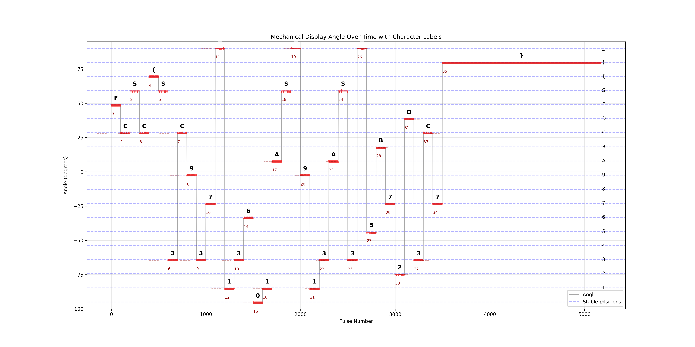

# Mechanical Display

This challenge provides us with a VCD file which represents the control signal applied to a little servo for a short span of time.

We thus wrote a script that extracts the timestamps of the rising and falling edges, used the provided linear relation between the control signal's pulse width and the angle of the servo and tried to map it to characters. But that was not sufficient as the angles were slightly shifted. So we corrected with the min and max values of the angles as seen on our first implementation and got this beautiful image of the movement of the arm over time.

To find the values of each character we considered a minimum duration during which the arm had to be in vicinity of the letter to prevent noise.

We thus obtained this beautiful plot of the movement of the arm over time



```py
import re

import matplotlib.pyplot as plt

characters = ['0', '1', '2', '3', '4', '5', '6', '7', '8', '9', 'A', 'B', 'C', 'D', 'F', 'S', '{', '}', '_']


def parse_vcd(file_path: str) -> list[tuple[int, int]]:
    with open(file_path, 'r') as f:
        content = f.read()

    timescale_match = re.search(r'\$timescale\s+(\d+)\s+(\w+)', content)
    if timescale_match:
        timescale_value = int(timescale_match.group(1))
        timescale_unit = timescale_match.group(2)
        print(f'Timescale: {timescale_value} {timescale_unit}')

    changes = []
    for line in content.split('\n'):
        if line.startswith('#'):
            parts = line.split()
            if len(parts) >= 2:
                time = int(parts[0][1:])  # Remove '#' and convert to int
                if len(parts) == 2 and (parts[1].endswith('0!') or parts[1].endswith('1!')):
                    value = int(parts[1][0])
                    changes.append((time, value))

    return changes


# Calculate pulse widths
def calculate_pulse_widths(changes: list[tuple[int, int]]) -> list[int]:
    pulse_widths = []
    pulse_start = None

    for time, value in changes:
        if value == 1:  # Rising edge
            pulse_start = time
        elif value == 0 and pulse_start is not None:  # Falling edge
            pulse_width = time - pulse_start
            pulse_widths.append(pulse_width)
            pulse_start = None

    return pulse_widths


def pulse_width_to_angle(pulse_width: int, timescale: int = 10) -> float:
    pulse_ms = pulse_width * timescale / 1000

    # Linear mapping from pulse width to angle based on servo specifications from datasheet
    # 0.6ms -> -90 degrees
    # 1.5ms -> 0 degrees
    # 2.4ms -> +90 degrees
    angle = -90 + (pulse_ms - 0.6) * (180 / (2.4 - 0.6))

    return angle


def plot_angles_over_time(
    angles: list[float],
    stable_segments: None | list[tuple[float, float, float, float]] = None,
) -> None:
    plt.figure(figsize=(20, 10))

    plt.plot(angles, color='gray', alpha=0.7, linewidth=1, label='Raw angles')

    observed_min_angle = -95
    observed_max_angle = 90.2
    observed_range = observed_max_angle - observed_min_angle
    angle_per_char = observed_range / (len(characters) - 1)

    for i, char in enumerate(characters):
        char_angle = observed_min_angle + i * angle_per_char
        plt.axhline(y=char_angle, color='blue', linestyle='--', alpha=0.3)
        plt.text(len(angles) + 10, char_angle, char, fontsize=10, va='center')

    if stable_segments:
        char_angles = {char: observed_min_angle + i * angle_per_char for i, char in enumerate(characters)}

        for i, (start, end, avg_angle, duration) in enumerate(stable_segments):
            plt.plot(
                range(start, end + 1),
                angles[start : end + 1],
                color='red',
                linewidth=2,
                alpha=0.7,
            )

            plt.axhline(
                y=avg_angle,
                xmin=start / len(angles),
                xmax=end / len(angles),
                color='darkred',
                linewidth=1,
                alpha=0.4,
                linestyle='--',
            )

            closest_char = None
            min_diff = float('inf')
            for char, char_angle in char_angles.items():
                diff = abs(avg_angle - char_angle)
                if diff < min_diff:
                    min_diff = diff
                    closest_char = char

            if min_diff < angle_per_char / 2:
                mid_x = (start + end) / 2
                plt.text(
                    mid_x,
                    avg_angle + 5,
                    closest_char,
                    fontsize=12,
                    fontweight='bold',
                    ha='center',
                    va='center',
                    bbox=dict(facecolor='white', alpha=0.7, edgecolor='none', pad=1),
                )

                plt.text(
                    start,
                    avg_angle - 5,
                    f'{i}',
                    fontsize=8,
                    color='darkred',
                    ha='left',
                    va='top',
                )

    plt.xlabel('Pulse Number')
    plt.ylabel('Angle (degrees)')
    plt.title('Mechanical Display Angle Over Time with Character Labels')

    plt.ylim(-100, 95)

    plt.grid(True, alpha=0.3)

    plt.legend(['Angle', 'Stable positions'], loc='lower right')

    plt.savefig('angle_over_time_labeled.png', dpi=300)

    plt.tight_layout()
    plt.show()


def main() -> None:
    vcd_file = 'mechanical-display.vcd'

    changes = parse_vcd(vcd_file)

    pulse_widths = calculate_pulse_widths(changes)

    angles = [pulse_width_to_angle(pw) for pw in pulse_widths]

    segments = []
    current_angle = angles[0]
    current_start = 0
    angle_threshold = 3.0

    for i, angle in enumerate(angles[1:], 1):
        if abs(angle - current_angle) > angle_threshold:
            duration = i - current_start
            avg_angle = sum(angles[current_start:i]) / duration
            segments.append((current_start, i - 1, avg_angle, duration))

            current_start = i
            current_angle = angle

    if current_start < len(angles):
        duration = len(angles) - current_start
        avg_angle = sum(angles[current_start:]) / duration
        segments.append((current_start, len(angles) - 1, avg_angle, duration))

    min_stable_duration = 20
    stable_segments = [s for s in segments if s[3] >= min_stable_duration]

    print(f'Total segments: {len(segments)}')
    print(f'Stable segments: {len(stable_segments)}')

    plot_angles_over_time(angles, stable_segments)

    clean_message = decode_stable_positions(angles)
    print('Decoded message (stable positions):', clean_message)

    flag_pattern = re.compile(r'FCSC\{[^}]*\}')
    matches = flag_pattern.findall(clean_message)
    if matches:
        print('Flag found:')
        for match in matches:
            print(match)


def decode_stable_positions(angles: list[float]) -> str:
    observed_min_angle = -95
    observed_max_angle = 90.2
    observed_range = observed_max_angle - observed_min_angle
    angle_per_char = observed_range / (len(characters) - 1)

    char_angles = {char: observed_min_angle + i * angle_per_char for i, char in enumerate(characters)}

    segments = []
    current_angle = angles[0]
    current_start = 0
    angle_threshold = 3.0

    for i, angle in enumerate(angles[1:], 1):
        if abs(angle - current_angle) > angle_threshold:
            duration = i - current_start
            if duration > 0:
                avg_angle = sum(angles[current_start:i]) / duration
                segments.append((current_start, i - 1, avg_angle, duration))

            current_start = i
            current_angle = angle

    if current_start < len(angles):
        duration = len(angles) - current_start
        if duration > 0:
            avg_angle = sum(angles[current_start:]) / duration
            segments.append((current_start, len(angles) - 1, avg_angle, duration))

    min_stable_duration = 20
    stable_segments = [s for s in segments if s[3] >= min_stable_duration]

    message = ''
    for start_idx, end_idx, avg_angle, duration in stable_segments:
        min_diff = float('inf')
        closest_char = None

        for char, char_angle in char_angles.items():
            diff = abs(avg_angle - char_angle)
            if diff < min_diff:
                min_diff = diff
                closest_char = char

        if closest_char is not None and min_diff < angle_per_char / 2.0:
            message += closest_char
        else:
            raise Warning(
                f'Angle {avg_angle} does not match any character. Closest character: {closest_char}, '
                f'Duration: {duration}, Start: {start_idx}, End: {end_idx}',
            )

    return message


if __name__ == '__main__':
    main()

```
